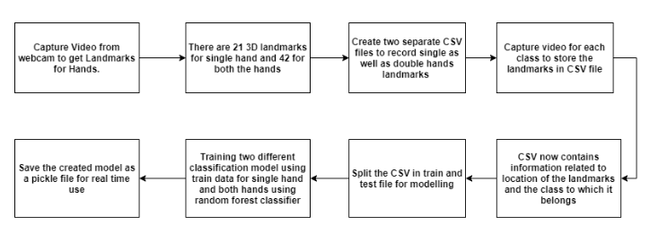
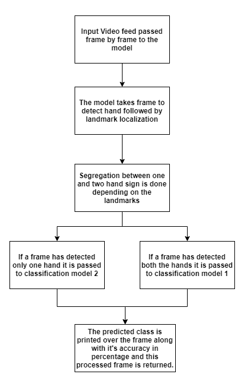
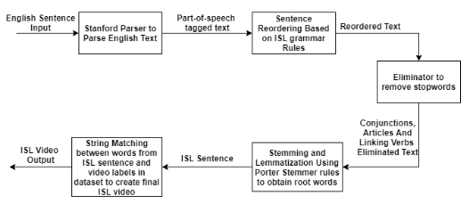

# README.md

## Table of Contents

- [About](#about)
- [Directory Structure](#structure)
- [Installation](#installation)
- [Algorithms](#algorithms)
- [Dataset](#dataset)
  
## About

An attempt to formulate a technological solution to provide Real-time translation to remove:
- **Linguistic barriers:** Add ease of communication by providing various means of language translation such as text, image, or document-enabled input.
- **Sign language barriers:** Using machine learning to translate sign language to text as well as NLP to translate text to sign language.

### Structure

The system of TransApp can be broadly divided into three parts:
1. Digital Interface (Web Application)
2. Web Server
3. Backend Modules
   - Rest APIs
   - Sign Language Detection Model
   - English Text to Indian Sign Language Conversion Module
   - Translation Helper Functions ( Language text Input, Image Input, Document Input) 

API has the following routes - (/home, /translate, /pdftranslate, /ocrtranslate, /t2s, /s2t, /video_feed)

## Installation

To get started with this dummy project, follow these steps:

1. Clone the repository from GitHub.
2. Set the Java path in the `eng2isl.py` module: replace: `java_path = r"C:\Program Files\Android\Android Studio\jre\bin"`.
3. Add sign videos for the Text to Sign module to the `txt_sign` folder.
4. Download Stanford Parser 4.2.0 and add its contents to the `txt2sign` folder.
5. Add the following jars(`stanford-parser.jar','stanford-parser-4.2.0-models.jar`) to jars folder under `txt2sign` .
6. Run app.py to start the server and access the functionalities on localhost.

## Algorithms
1. Indian Sign Language Recognition
    - Model Creation Phase
    
   

    - Detection Phase
    
    
  
3. English Text to Indian Sign Language
   
   

## Dataset
1. Dataset Used for Text to Sign Language:
   - ISL dataset https://indiansignlanguage.org/ by RKMVERI, The Faculty of Disability Management and Special Education.
     
2. Dataset Created for Sign Language Recognition:
   - This approach involved the use of integrated Webcam to record 18 different dynamic ISL Signs and the corresponding 3D hand landmarks into train CSV files.
     Final Dataset included two separate CSV files:
     - Single Handed (11 classes) - [rows(15,500), columns(85)] (See, Hello, Mango, Eat, Morning, Tall, Good, Sorry, What, This, You)
     - Double Handed (7 classes) - [rows(10,500), columns(169)] (Perfect, Thank You, Dance, Sleep, Time, Late, Work)

